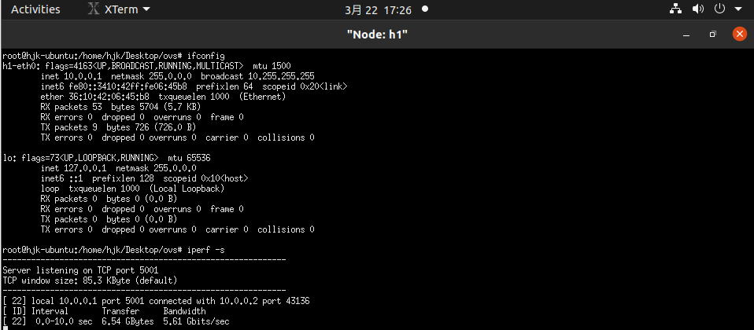
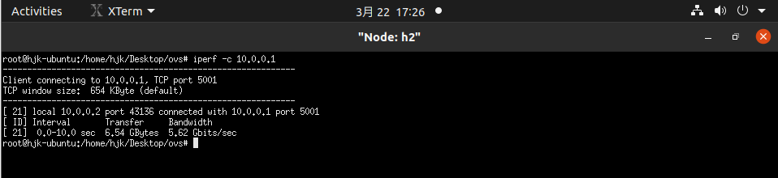
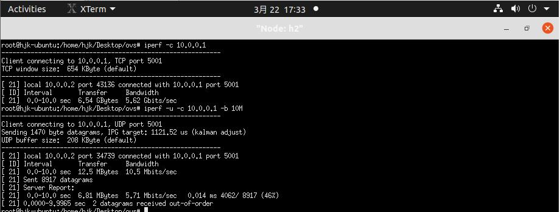
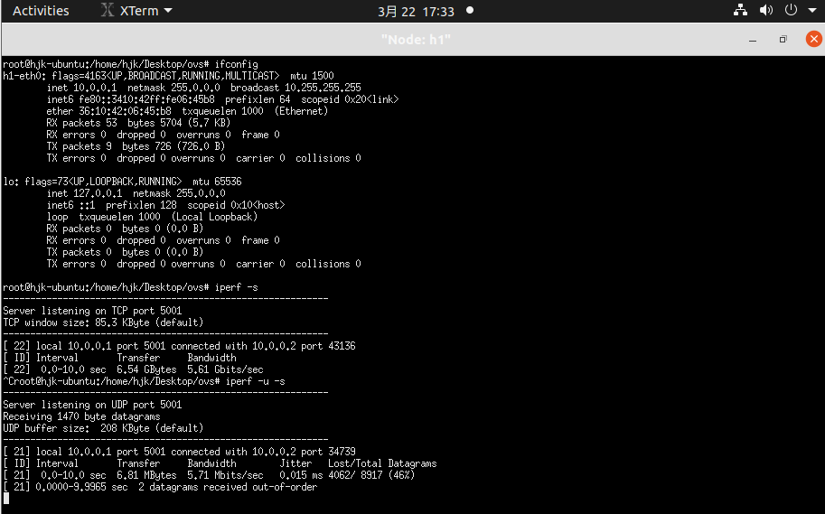
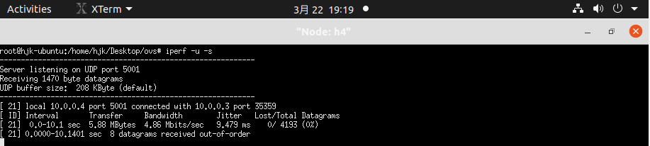
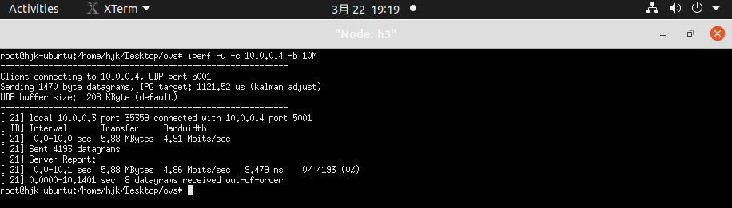
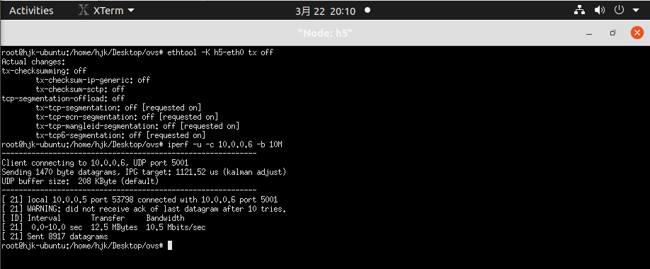
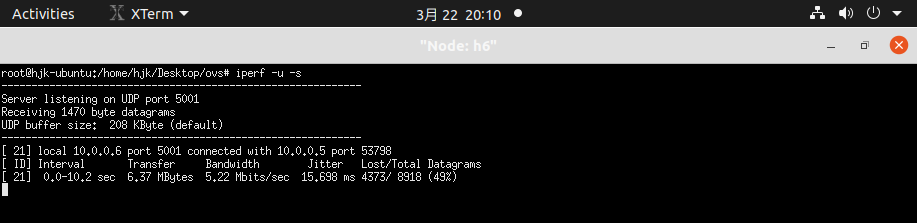
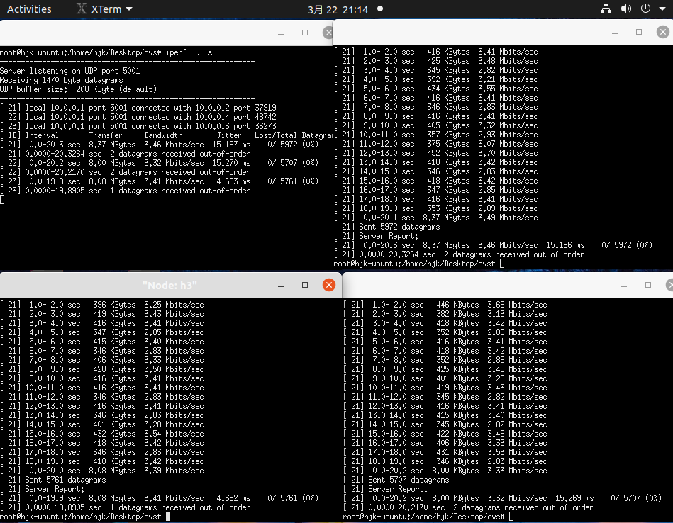
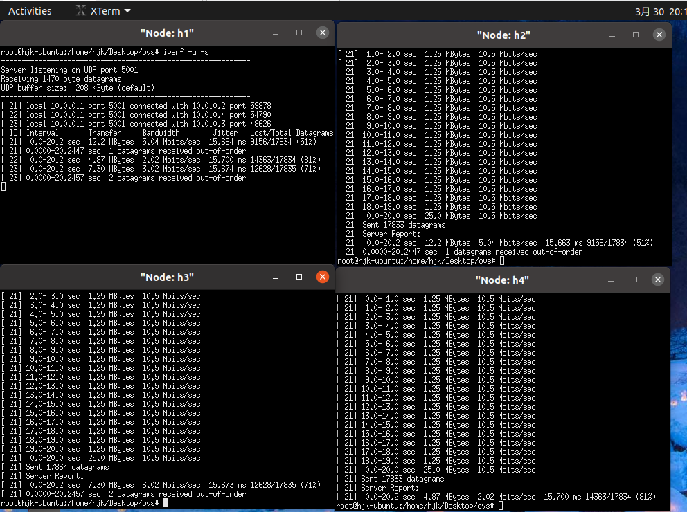

# Lab3: QoS Implementation with OvS

## Part1
### Task1



## Part2
### Task2.1



### Task2.2



### Question1
````sh
$ ovs-ofctl add-flow s1 in_port=5,action=meter:1,output:6 -O openflow13
````
作用:下发流表
 - ````ovs-ofctl````是流表操作指令
 - ````add-flow````表示添加流表
 - ````s1````表示向switch s1添加流表
 - ````in_port=5, action=meter:1,output:6````描述了要添加的流表项, 具体表示数据包从5号端口进入, 使用1号meter表, 然后从2号端口转发出去
 - ````-O openflow13````表示使用的OpenFlow版本为openflow13

````sh
$ ovs-ofctl dump-flows s1 -O openflow13
````
作用:查看流表
 - ````ovs-ofctl````是流表操作指令
 - ````dump-flows````表示查看当前流表
 - ````s1````表示对应的switch为s1
 - ````-O openflow13````表示使用的OpenFlow版本为openflow13

### Task2.3



### Question2
|限速方式|带宽/(Mb/s)|抖动/ms|丢包率|
|-------|----|----|-----|
|网卡限速|5.71|0.015|46%|
|队列限速|4.86|9.479|0|
|Meter表限速|5.22|15.698|49%|
 - 丢包率:网卡限速和Meter表限速都是通过丢弃多于数据包实现限速, 因此丢包率相近, 且接近于````(发送带宽(10M)-实际测量带宽)/发送带宽````(50%),队列限速通过缓存数据包实现限速, 不会丢弃包, 因此丢包率为0;
 - 带宽:三者带宽接近, 约等于限制的最大带宽, 其中网卡限速测量带宽最大, 队列限速测量带宽最小, 网卡限速偏离最大限速带宽最多, 表明网卡的限速准确度最低, 队列限速的准确度最高;带宽控制准确率的不同可能与不同速度测量方式和控制方式有关，队列限速直接控制发送队列的速率, 比Meter表限速在switch控制和网卡限速在网卡限速控制更加精准, 受传输等其他因素影响更小, 对网速的测量可能也更准确.
 - 抖动: 抖动描述了最大端到端延迟和最小端到端延迟的极差; Meter表限速抖动最高, 网卡限速抖动最低; 网卡限速由于在发送端、switch和接收端都几乎没有任何处理工作和拥塞而抖动几乎为0; Meter表限速由于数据包要被switch处理(由于进程调度和switch处理能力限制不同数据包处理时间可能差异较大)而抖动最高; 队列限速由于不同包在队列中的延迟时间不同也具有较高抖动, 但仍小于Meter表限速. 

### Task3
限速方式: 队列限速
````sh
sudo ovs-vsctl set port s1-eth1 qos=@newqos --  --id=@newqos create qos type=linux-htb queues=0=@q0 -- --id=@q0 create queue other-config:max-rate=10000000
````
测量结果

client对三个server的带宽基本相同, 由于三个网路流优先级相同, 限速算法的公平性和丢包的随机性保证了三者带宽相同

### Task4
````sh
# 使用队列限制client带宽为10M
$ sudo ovs-vsctl set port s1-eth1 qos=@newqos --  --id=@newqos create qos type=linux-htb queues=0=@q0 -- --id=@q0 create queue other-config:max-rate=10000000

# 添加2号端口进入转发到1号端口的meter表, 带宽限制为5M
$ sudo ovs-ofctl add-meter s1 meter=1,kbps,band=type=drop,rate=5000 -O OpenFlow13
$ sudo ovs-ofctl add-flow s1 in_port=2,action=meter:1,output:1 -O openflow13

# 添加3号端口进入转发到1号端口的meter表, 带宽限制为3M
$ sudo ovs-ofctl add-meter s1 meter=2,kbps,band=type=drop,rate=3000 -O OpenFlow13
$ sudo ovs-ofctl add-flow s1 in_port=3,action=meter:2,output:1 -O openflow13

# 添加4号端口进入转发到1号端口的meter表, 带宽限制为2M
$ sudo ovs-ofctl add-meter s1 meter=3,kbps,band=type=drop,rate=2000 -O OpenFlow13
$ sudo ovs-ofctl add-flow s1 in_port=4,action=meter:3,output:1 -O openflow13

````

实验结果:


注:

题目要求保证h2和h3的带宽下限, 但使用上述三种限速方式只能设置带宽上限, 但是在发送带宽大于switch限制带宽的情况下, 限速的带宽上限应等于实际保证的带宽下限, 因此使用限速手段可以实现题目需求.
